# 1. Flowchart Sistem Berdasarkan ERD Lengkap

## Flowchart Sistem Manajemen Aset Kantor 

```mermaid
%%{init: {'flowchart': {'curve': 'linear', 'htmlLabels': true}, 'theme': 'default'}}%%
flowchart TD
    Start([START]) --> Auth["🔐 Login"]
    Auth --> AuthCheck{Berhasil?}
    AuthCheck -->|Tidak| Auth
    AuthCheck -->|Ya| Dashboard["📊 Dashboard"]
    
    Dashboard --> MainMenu{"Menu<br/>Utama"}
    
    MainMenu -->|1| DataMgmt["📋 Data Master"]
    MainMenu -->|2| LoanMgmt["🔄 Peminjaman"]
    MainMenu -->|3| Report["📈 Laporan"]
    MainMenu -->|4| Settings["⚙️ Setting"]
    
    %% DATA MANAGEMENT
    DataMgmt --> DChoice{"Pilih<br/>Data"}
    DChoice -->|Pegawai| D1["👤 PEGAWAI<br/>CRUD"]
    DChoice -->|Aset| D2["🏢 ASET<br/>CRUD"]
    DChoice -->|Barang| D3["📦 BARANG<br/>CRUD"]
    DChoice -->|Kategori| D4["🏷️ KATEGORI<br/>CRUD"]
    DChoice -->|Lokasi| D5["📍 LOKASI<br/>CRUD"]
    DChoice -->|Kondisi| D6["✅ KONDISI<br/>CRUD"]
    
    D1 --> V1{Valid?}
    D2 --> V2{Valid?}
    D3 --> V3{Valid?}
    D4 --> V4{Valid?}
    D5 --> V5{Valid?}
    D6 --> V6{Valid?}
    
    V1 -->|Ya| S1["💾 Simpan"]
    V1 -->|Tidak| E1["❌ Error"]
    V2 -->|Ya| S2["💾 Simpan"]
    V2 -->|Tidak| E2["❌ Error"]
    V3 -->|Ya| S3["💾 Simpan"]
    V3 -->|Tidak| E3["❌ Error"]
    V4 -->|Ya| S4["💾 Simpan"]
    V4 -->|Tidak| E4["❌ Error"]
    V5 -->|Ya| S5["💾 Simpan"]
    V5 -->|Tidak| E5["❌ Error"]
    V6 -->|Ya| S6["💾 Simpan"]
    V6 -->|Tidak| E6["❌ Error"]
    
    E1 --> DChoice
    E2 --> DChoice
    E3 --> DChoice
    E4 --> DChoice
    E5 --> DChoice
    E6 --> DChoice
    
    S1 --> L1["📝 Log"]
    S2 --> L2["📝 Log"]
    S3 --> L3["📝 Log"]
    S4 --> L4["📝 Log"]
    S5 --> L5["📝 Log"]
    S6 --> L6["📝 Log"]
    
    L1 --> DChoice
    L2 --> DChoice
    L3 --> DChoice
    L4 --> DChoice
    L5 --> DChoice
    L6 --> DChoice
    
    %% LOAN MANAGEMENT
    LoanMgmt --> LChoice{"Pilih<br/>Aksi"}
    LChoice -->|Ajukan| LA["➕ Ajukan"]
    LChoice -->|Lihat| LV["👁️ Lihat"]
    LChoice -->|Kembali| LR["↩️ Kembalikan"]
    
    LA --> LP["Pilih Pegawai<br/>& Aset"]
    LP --> LC{Tersedia?}
    LC -->|Tidak| LR1["❌ Tolak"]
    LR1 --> LChoice
    LC -->|Ya| LC1["✅ Buat Record"]
    LC1 --> LU["🔄 Update Status"]
    LU --> LL1["📝 Log"]
    LL1 --> LChoice
    
    LV --> LChoice
    
    LR --> LI["Input Kondisi"]
    LI --> LCK{Normal?}
    LCK -->|Ya| LU2["Update ASET"]
    LCK -->|Tidak| LM["🔧 Maintenance"]
    LM --> LU3["Update ASET"]
    LU2 --> LU4["Update Peminjaman"]
    LU3 --> LU4
    LU4 --> LL2["📝 Log"]
    LL2 --> LChoice
    
    %% REPORT
    Report --> RChoice{"Laporan"}
    RChoice -->|Aset| R1["📊 Data Aset"]
    RChoice -->|Barang| R2["📦 Data Barang"]
    RChoice -->|Peminjaman| R3["🔄 Peminjaman"]
    RChoice -->|Maintenance| R4["🔧 Maintenance"]
    RChoice -->|Riwayat| R5["📝 Riwayat"]
    RChoice -->|Log| R6["📋 Log"]
    
    R1 --> EX1{"Format?"}
    R2 --> EX2{"Format?"}
    R3 --> EX3{"Format?"}
    R4 --> EX4{"Format?"}
    R5 --> EX5{"Format?"}
    R6 --> EX6{"Format?"}
    
    EX1 -->|PDF| D1_P["📄 PDF"]
    EX1 -->|Excel| D1_E["📊 Excel"]
    EX2 -->|PDF| D2_P["📄 PDF"]
    EX2 -->|Excel| D2_E["📊 Excel"]
    EX3 -->|PDF| D3_P["📄 PDF"]
    EX3 -->|Excel| D3_E["📊 Excel"]
    EX4 -->|PDF| D4_P["📄 PDF"]
    EX4 -->|Excel| D4_E["📊 Excel"]
    EX5 -->|PDF| D5_P["📄 PDF"]
    EX5 -->|Excel| D5_E["📊 Excel"]
    EX6 -->|PDF| D6_P["📄 PDF"]
    EX6 -->|Excel| D6_E["📊 Excel"]
    
    D1_P --> DL1["⬇️ Download"]
    D1_E --> DL1
    D2_P --> DL2["⬇️ Download"]
    D2_E --> DL2
    D3_P --> DL3["⬇️ Download"]
    D3_E --> DL3
    D4_P --> DL4["⬇️ Download"]
    D4_E --> DL4
    D5_P --> DL5["⬇️ Download"]
    D5_E --> DL5
    D6_P --> DL6["⬇️ Download"]
    D6_E --> DL6
    
    DL1 --> RChoice
    DL2 --> RChoice
    DL3 --> RChoice
    DL4 --> RChoice
    DL5 --> RChoice
    DL6 --> RChoice
    
    %% SETTINGS
    Settings --> SChoice{"Pilih"}
    SChoice -->|User| SU["👥 Kelola User"]
    SChoice -->|Role| SR["🔐 Kelola Role"]
    
    SU --> SVU{Valid?}
    SR --> SVR{Valid?}
    
    SVU -->|Ya| SSU["💾 Simpan"]
    SVU -->|Tidak| SEU["❌ Error"]
    SVR -->|Ya| SSR["💾 Simpan"]
    SVR -->|Tidak| SER["❌ Error"]
    
    SEU --> SChoice
    SER --> SChoice
    SSU --> SLU["📝 Log"]
    SSR --> SLR["📝 Log"]
    SLU --> SChoice
    SLR --> SChoice
    
    %% BACK TO DASHBOARD
    DChoice -->|Kembali| Dashboard
    LChoice -->|Kembali| Dashboard
    RChoice -->|Kembali| Dashboard
    SChoice -->|Kembali| Dashboard
    
    Dashboard --> Exit{Keluar?}
    Exit -->|Tidak| Dashboard
    Exit -->|Ya| Logout["🔓 Logout"]
    Logout --> End(["END"])
    
    style Start fill:#4CAF50,stroke:#2E7D32,stroke-width:2px,color:#fff
    style End fill:#f44336,stroke:#c62828,stroke-width:2px,color:#fff
    style Dashboard fill:#2196F3,stroke:#1565c0,stroke-width:2px,color:#fff
    style Auth fill:#FF9800,stroke:#E65100,stroke-width:2px,color:#fff
    
    style DataMgmt fill:#00BCD4,stroke:#00838f,stroke-width:2px,color:#fff
    style LoanMgmt fill:#00BCD4,stroke:#00838f,stroke-width:2px,color:#fff
    style Report fill:#00BCD4,stroke:#00838f,stroke-width:2px,color:#fff
    style Settings fill:#00BCD4,stroke:#00838f,stroke-width:2px,color:#fff
    
    style L1 fill:#FFC107,color:#000
    style L2 fill:#FFC107,color:#000
    style L3 fill:#FFC107,color:#000
    style L4 fill:#FFC107,color:#000
    style L5 fill:#FFC107,color:#000
    style L6 fill:#FFC107,color:#000
    style LL1 fill:#FFC107,color:#000
    style LL2 fill:#FFC107,color:#000
    style SLU fill:#FFC107,color:#000
    style SLR fill:#FFC107,color:#000
```


# Penjelasan Flowchart Sistem Manajemen Aset Kantor

## 🔐 **1. Login & Autentikasi**
```
START → Login → Login Berhasil? 
  ├─ Tidak → Kembali ke Login (loop)
  └─ Ya → Dashboard
```
**Penjelasan:** Sistem dimulai dengan pengguna melakukan login. Kredensial divalidasi di tabel **PENGGUNA**. Jika salah, pengguna diminta login ulang. Jika benar, masuk ke dashboard.

---

## 📊 **2. Dashboard Utama**
```
Dashboard → Pilih Menu Utama
  ├─ 1. Data Master
  ├─ 2. Peminjaman
  ├─ 3. Laporan
  └─ 4. Setting
```
**Penjelasan:** Dashboard menampilkan 4 menu pilihan utama. Pengguna bisa memilih salah satu sesuai kebutuhan.

---

## 📋 **3. Menu Data Master** (CRUD)
```
Data Master → Pilih Data
  ├─ Pegawai → Input Data → Valid? 
  ├─ Aset → Input Data → Valid?
  ├─ Barang → Input Data → Valid?
  ├─ Kategori → Input Data → Valid?
  ├─ Lokasi → Input Data → Valid?
  └─ Kondisi → Input Data → Valid?
```

### **Alur Detail untuk Setiap Data:**

#### **Contoh: Kelola ASET**
```
1. Pilih "Aset"
2. Input data:
   - ID Aset
   - Kode Aset
   - Nama Aset
   - Kategori
   - Harga
   - Kondisi

3. Validasi Data:
   ├─ VALID (semua field terisi dengan benar)
   │  └─ Simpan ke Database
   │     └─ Catat di LOG_AKTIVITAS & RIWAYAT_PERUBAHAN
   │        └─ Kembali ke Pilih Data
   │
   └─ TIDAK VALID (ada field kosong/error)
      └─ Tampilkan Error Message
         └─ Kembali ke Pilih Data (untuk input ulang)
```

**Relasi Database yang Digunakan:**
- ASET table menyimpan data aset
- KATEGORI table untuk referensi kategori aset
- LOKASI table untuk referensi lokasi penyimpanan
- KONDISI_ASET table untuk status kondisi

---

## 🔄 **4. Menu Peminjaman** (3 Aksi)

### **A. AJUKAN PEMINJAMAN**
```
Ajukan Peminjaman
    ↓
Pilih Pegawai (dari tabel PEGAWAI)
    ↓
Pilih Aset (dari tabel ASET)
    ↓
Cek: Apakah ASET tersedia?
    ├─ TIDAK (sedang dipinjam orang lain)
    │  └─ Tolak Peminjaman → Kembali ke Menu Peminjaman
    │
    └─ YA (aset tersedia)
       ├─ Buat Record PEMINJAMAN_ASET
       │  (tgl_peminjaman = hari ini, status = DIPINJAM)
       ├─ Update ASET status menjadi DIPINJAM
       ├─ Catat di LOG_AKTIVITAS & RIWAYAT_PERUBAHAN
       ├─ Konfirmasi Peminjaman (Cetak Bukti)
       └─ Kembali ke Menu Peminjaman
```

**Relasi Database:**
- PEMINJAMAN_ASET (primary)
- PEGAWAI (foreign key id_pegawai)
- ASET (foreign key id_aset)

**Contoh Data Tersimpan:**
| id_peminjaman | id_pegawai | id_aset | tgl_peminjaman | status |
|---|---|---|---|---|
| P001 | E001 | A005 | 2026-06-20 | DIPINJAM |

---

### **B. LIHAT PEMINJAMAN**
```
Lihat Daftar Peminjaman
    ├─ Filter berdasarkan:
    │  ├─ Status (DIPINJAM / DIKEMBALIKAN)
    │  ├─ Nama Pegawai
    │  └─ Tanggal Peminjaman
    └─ Kembali ke Menu Peminjaman
```
**Fungsi:** Hanya menampilkan data peminjaman yang sudah ada, tanpa perubahan.

---

### **C. PROSES PENGEMBALIAN**
```
Proses Pengembalian
    ↓
Input Tanggal Pengembalian
    ↓
Masukkan Kondisi ASET:
    ├─ NORMAL (tidak rusak)
    │  ├─ Update ASET status = TERSEDIA
    │  └─ (Tidak perlu maintenance)
    │
    └─ RUSAK / PERBAIKAN DIPERLUKAN
       ├─ Buat Record MAINTENANCE
       │  (jenis_perbaikan, status = PENDING)
       └─ Update ASET status = MAINTENANCE
           (tidak tersedia sampai diperbaiki)

    ↓
Update PEMINJAMAN_ASET
  ├─ tgl_pengembalian = input user
  └─ status = DIKEMBALIKAN

    ↓
Catat di LOG_AKTIVITAS & RIWAYAT_PERUBAHAN
    ↓
Konfirmasi Pengembalian
    ↓
Kembali ke Menu Peminjaman
```

**Relasi Database yang Terlibat:**
- PEMINJAMAN_ASET (update)
- ASET (update status)
- MAINTENANCE (insert jika rusak)
- LOG_AKTIVITAS (insert)
- RIWAYAT_PERUBAHAN (insert)

---

## 📈 **5. Menu Laporan** (6 Jenis)

### **Alur Umum Laporan:**
```
Pilih Laporan
    ├─ Laporan DATA ASET
    ├─ Laporan DATA BARANG
    ├─ Laporan PEMINJAMAN
    ├─ Laporan MAINTENANCE
    ├─ Laporan RIWAYAT PERUBAHAN
    └─ Laporan LOG AKTIVITAS

    ↓ (untuk setiap laporan)

Pilih Format Export:
    ├─ PDF → Generate PDF → Download
    └─ Excel → Generate Excel → Download

    ↓
Kembali ke Pilih Laporan
```

### **Detail Setiap Laporan:**

| Laporan | Query Database | Isi |
|---------|---|---|
| **Data Aset** | ASET + KATEGORI + LOKASI | ID, Kode, Nama, Kategori, Harga, Kondisi, Lokasi |
| **Data Barang** | BARANG + KATEGORI | ID, Kode, Nama, Kategori, Stok, Harga |
| **Peminjaman** | PEMINJAMAN_ASET + PEGAWAI + ASET | Pegawai, Aset, Tgl Pinjam, Tgl Kembali, Status |
| **Maintenance** | MAINTENANCE + ASET | Aset, Jenis Perbaikan, Biaya, Status, Catatan |
| **Riwayat** | RIWAYAT_PERUBAHAN | Aset, Tanggal, Perubahan, Nilai Lama, Nilai Baru |
| **Log Aktivitas** | LOG_AKTIVITAS + PENGGUNA | User, Aktivitas, Tabel Target, Waktu, IP Address |

---

## ⚙️ **6. Menu Setting** (2 Fitur)

### **A. KELOLA PENGGUNA**
```
Kelola Pengguna
    ↓
Input/Edit Data Pengguna:
  ├─ Username
  ├─ Password
  ├─ Role (Admin, Operator, Viewer)
  └─ Status (Active/Inactive)

    ↓
Validasi Data:
  ├─ VALID → Simpan ke tabel PENGGUNA
  └─ TIDAK VALID → Tampilkan Error

    ↓
Catat di LOG_AKTIVITAS
    ↓
Kembali ke Setting
```

**Tabel yang Digunakan:**
- PENGGUNA (primary)
- LOG_AKTIVITAS (untuk audit)

---

### **B. KELOLA ROLE & PERMISSION**
```
Kelola Role & Permission
    ↓
Assign akses menu untuk setiap role:
  ├─ Admin → Akses semua menu
  ├─ Operator → Akses Data + Peminjaman + Laporan
  └─ Viewer → Hanya Laporan

    ↓
Validasi & Simpan Permission
    ↓
Catat di LOG_AKTIVITAS
    ↓
Kembali ke Setting
```

---

## 🔄 **7. Alur Kembali ke Dashboard**
```
Dari Menu Manapun:
  └─ Klik "Kembali"
     └─ Kembali ke Dashboard
        └─ Bisa pilih menu lain atau Logout
```

---

## 🔓 **8. Proses Logout**
```
Di Dashboard:
  ├─ Keluar Sistem?
  │  ├─ Tidak → Tetap di Dashboard
  │  └─ Ya → Logout
  │
  └─ Logout:
     ├─ Update status_pengguna = OFFLINE
     ├─ Catat di LOG_AKTIVITAS
     └─ END (kembali ke halaman login)
```

---

## 📊 **Ringkasan Relasi Database**

```
┌─────────────────────────────────────┐
│    PEGAWAI                          │
│  (Master Data Karyawan)             │
└──────────────┬──────────────────────┘
               │ 1:M (Memiliki)
               ↓
┌─────────────────────────────────────┐
│    PEMINJAMAN_ASET                  │
│  (Transaksi Peminjaman)             │
└──────────────┬──────────────────────┘
               │ M:1 (Mereferensi)
               ↓
┌─────────────────────────────────────┐
│    ASET / BARANG                    │
│  (Master Data Aset & Barang)        │
└──────────────┬──────────────────────┘
               │ M:1 (Mereferensi)
     ┌─────────┴──────────┐
     ↓                    ↓
┌──────────────┐  ┌──────────────────┐
│  KATEGORI    │  │    LOKASI        │
│              │  │                  │
└──────────────┘  └──────────────────┘

ASET → MAINTENANCE (1:M - Perawatan Aset)
ASET → RIWAYAT_PERUBAHAN (1:M - Audit Trail)
PENGGUNA → LOG_AKTIVITAS (1:M - Logging Aktivitas)
```

---

## 🎯 **Fitur Keamanan & Audit**

Setiap kali ada perubahan data:
1. ✅ Data disimpan ke database
2. 📝 Aktivitas dicatat di **LOG_AKTIVITAS** dengan:
   - Username pengguna
   - Jenis aktivitas (Create/Read/Update/Delete)
   - Tabel yang diubah
   - Tanggal & Waktu
   - IP Address
3. 🔄 Perubahan detail dicatat di **RIWAYAT_PERUBAHAN** dengan:
   - ID Aset yang diubah
   - Tanggal perubahan
   - Nilai lama vs Nilai baru
   - Keterangan perubahan

---

## 📌 **Tabel Ringkas - Setiap Menu & Fungsinya**

| Menu | Fungsi | Tabel yang Digunakan | Output |
|------|--------|---|---|
| **Login** | Autentikasi pengguna | PENGGUNA | Session Active |
| **Data Master** | CRUD 6 data master | ASET, BARANG, PEGAWAI, KATEGORI, LOKASI, KONDISI_ASET | Data tersimpan + Log |
| **Peminjaman** | Kelola peminjaman aset | PEMINJAMAN_ASET, PEGAWAI, ASET, MAINTENANCE | Record peminjaman |
| **Laporan** | Export data laporan | Semua tabel | PDF/Excel |
| **Setting** | Manajemen user & role | PENGGUNA, Permission | User terdaftar |
| **Logout** | Keluar sistem | LOG_AKTIVITAS | Session OFF |

---

**Keseluruhan Flowchart ini memastikan sistem berjalan dengan aman, terstruktur, dan semua aktivitas tercatat untuk keperluan audit!** 🎉
